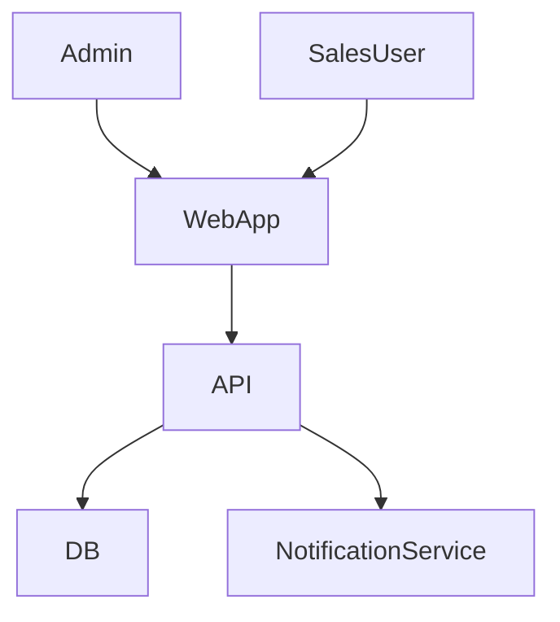

# System Design Case Study Guide

## Purpose
This guide provides a reusable template for documenting system design case studies, with a dedicated section for the Candidate's chosen project(s). It emphasizes clarity, measurable outcomes, and the use of Mermaid markdown for diagrams.

## General Case Study Structure

### 1. Problem Statement
- Briefly describe the business or technical problem the system addresses.

### 2. Requirements
- List functional and non-functional requirements.

### 3. High-Level Architecture
- Use Mermaid markdown for system/component diagrams.
	```mermaid
	graph TD
			User --> UI
			UI --> API
			API --> DB
	```

### 4. Key Components/Modules
- Describe each major component and its responsibilities.

### 5. Data Flow and Interactions
- Explain how data moves through the system.
- Add sequence or flow diagrams as needed.

### 6. Scalability, Security, and Extensibility
- Discuss how the system handles growth, protects data, and adapts to new requirements.

### 7. Trade-offs and Decisions
- Note any important architectural choices and their rationale.

### 8. Results/Impact
- Focus on measurable outcomes (e.g., performance improvements, user adoption, error reduction).
- If metrics are unavailable, provide a concise qualitative summary.

---

## Example: Sales Target Management Project

### Problem Statement
- Enable small businesses to track and manage sales targets for distributed teams.

### Requirements
- Functional: User management, target assignment, progress tracking, notifications.
- Non-functional: Responsive UI, secure data storage, easy onboarding.

### High-Level Architecture


### Key Components/Modules
- WebApp (Angular): Dashboard, target assignment, progress visualization.
- API (Node/Spring Boot): Auth, business logic, data persistence.
- NotificationService: Email/SMS alerts.

### Data Flow and Interactions
- Admin assigns targets → API stores in DB → SalesUser views/updates progress → Notifications sent on milestones.

### Scalability, Security, and Extensibility
- Designed for multi-tenant use, JWT-based auth, modular notification system.

### Trade-offs and Decisions
- Chose Angular Material for rapid UI development.
- Used REST API for simplicity and future mobile app integration.

### Results/Impact
- Reduced manual tracking by 80%.
- Enabled real-time progress visibility for distributed teams.

---

## Example Topics
- Migrating legacy systems to modern stack
- Designing for high availability and performance
- Implementing RBAC and secure APIs

## Notes
- Always use Mermaid diagrams for clarity.
- Update the guide with new case studies as needed.
- Focus on measurable outcomes where possible.